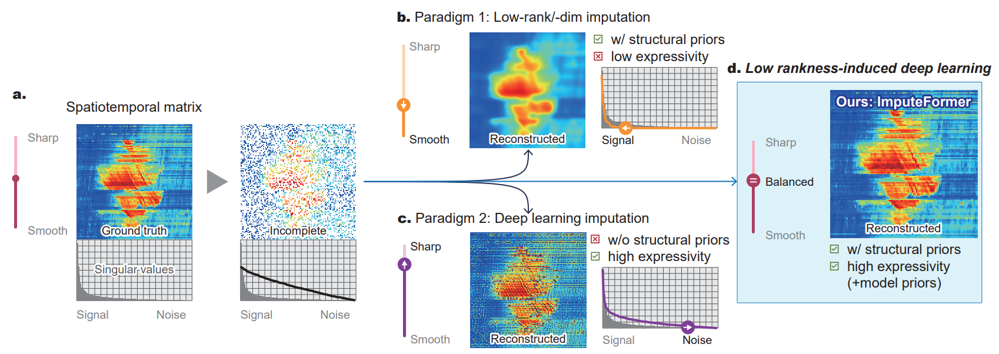

# <div align="center">[KDD-24] ImputeFormer: Low Rankness-Induced Transformers for Generalizable Spatiotemporal Imputation </div>

[](https://dl.acm.org/doi/abs/10.1145/3637528.3671751)
[](https://arxiv.org/abs/2312.01728)

**[News 202409] Our work has received a lot of feedbacks from the KDD community in Barcelona. Many thanks for your suggestions!**

**[News 202408] Our work has reported by [“时空探索之旅”](https://mp.weixin.qq.com/s/Bw1FE0KW--Wmjk2BlXXNGw). Feel free to discuss it with us!**

**‼️[News 202407][PyPOTS implementation of [ImputeFormer](https://github.com/WenjieDu/PyPOTS/tree/main/pypots/imputation/imputeformer) is now available inside [PyPOTS](https://github.com/WenjieDu/PyPOTS), an open-source Python library for reality-centric machine/deep learning and data mining on partially-observed time series. The ecosystem of PyPOTS supports a comprehensive benchmark of imputation tasks.**

**Our official implementation based on [Torch Spatiotemporal](https://github.com/TorchSpatiotemporal/tsl) will also be made available soon!!**

---


<h2 align=center>Imputeformer in a nutshell</h2>

<div align=center>
	
	<p align=left style="color: #777">Our motivation: (a) The distribution of singular values in spatiotemporal data is long-tailed. The existence of missing data can increase its rank (or singular values). (b) Low-rank models can filter out informative signals and generate a smooth reconstruction, resulting in truncating too much energy in the left part of its spectrum. (c) Deep models can preserve high-frequency noise and generate sharp imputations, maintaining too much energy for the right part of the singular spectrum. With the generality of low-rank models and the expressivity of deep models, ImputeFormer achieves a signal-noise balance for accurate imputation.</p>
</div>

---

---

## Directory structure

The directory is structured as follows:

```
.
├── config/
│   ├── imputation/
│   │── Imputeformer.yaml
│   │── brits.yaml
│   │── grin.yaml
│   │── saits.yaml
│   │── spin.yaml
│   └── transformer.yaml
├── experiments/
│   └── run_imputation.py
├── Imputeformer/
│   ├── baselines/
│   ├── imputers/
│   ├── layers/
│   ├── models/
│   └── ...
├── conda_env.yaml
└── tsl_config.yaml

```

## Get Started
Following the instructions in [SPIN](https://github.com/Graph-Machine-Learning-Group/spin) and [tsl](https://github.com/TorchSpatiotemporal), the project dependencies can be installed:

```bash
conda env create -f conda_env.yml
conda activate imputeformer
```


# Run experiments

The experiment scripts are in the `experiments` folder.

* `run_imputation.py` is used to run models including both ImputeFormer and baselines. An example of usage is

	```bash
	conda activate imputeformer
	python ./experiments/run_imputation.py --config imputation/imputeformer_la.yaml --model-name imputeformer --dataset-name la_block
	```

* `run_inference.py` is used for inference only using pre-trained models. An example of usage is

	```bash
	conda activate imputeformer
	python ./experiments/run_inference.py --config inference.yaml --model-name imputeformer --dataset-name la_point --exp-name {exp_name}
	```


## Bibtex reference

If you find this code useful please consider to cite our paper:

```
@inproceedings{10.1145/3637528.3671751,
author = {Nie, Tong and Qin, Guoyang and Ma, Wei and Mei, Yuewen and Sun, Jian},
title = {ImputeFormer: Low Rankness-Induced Transformers for Generalizable Spatiotemporal Imputation},
year = {2024},
isbn = {9798400704901},
publisher = {Association for Computing Machinery},
address = {New York, NY, USA},
url = {https://doi.org/10.1145/3637528.3671751},
doi = {10.1145/3637528.3671751},
booktitle = {Proceedings of the 30th ACM SIGKDD Conference on Knowledge Discovery and Data Mining},
pages = {2260–2271},
numpages = {12},
keywords = {data imputation, low-rank modeling, missing data, spatiotemporal data, time series, transformers},
location = {Barcelona, Spain},
series = {KDD '24}
}
```

## Acknowledgement

We acknowledge [SPIN](https://github.com/Graph-Machine-Learning-Group/spin) for providing a useful benchmark tool and training pipeline and [TorchSpatiotemporal](https://github.com/TorchSpatiotemporal) for helpful model implementations.
